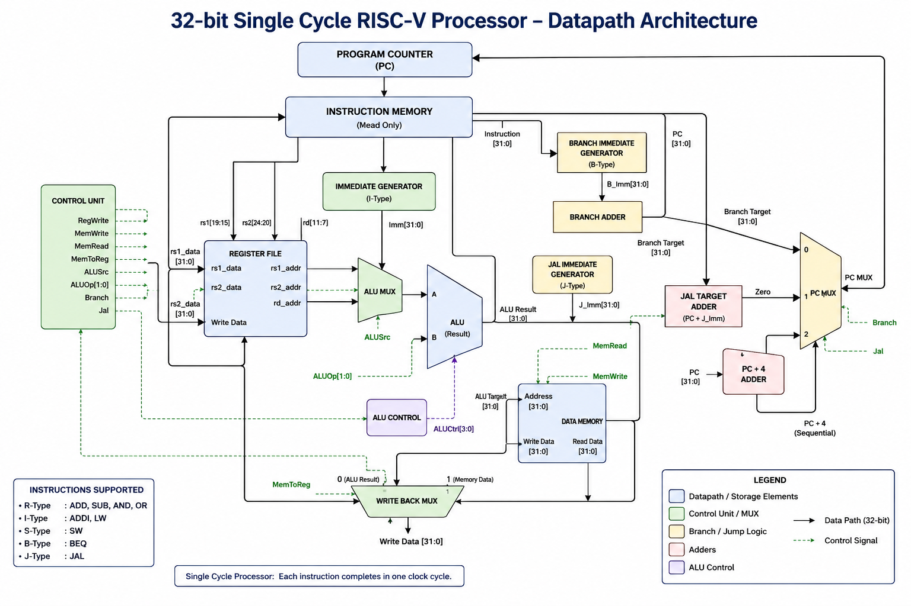

# 32-bit Single-Cycle RISC-V Processor


A **32-bit Single-Cycle RISC-V Processor** designed and implemented in **Verilog HDL**. This project implements the core datapath and control logic for a subset of the **RV32I instruction set**, including arithmetic, logical, memory, branch, and jump instructions. The processor was verified using **Icarus Verilog** and **GTKWave**.

---

# Project Overview

This processor executes every instruction in a **single clock cycle** by integrating the following hardware components:

- Program Counter (PC)
- Instruction Memory
- Register File
- Control Unit
- Immediate Generator
- ALU & ALU Decoder
- ALU Multiplexer
- Data Memory
- Write-Back Multiplexer
- Branch Comparator
- Branch Adder
- Branch Immediate Generator
- JAL Immediate Generator
- PC Multiplexer

The design demonstrates the complete execution flow of a single-cycle processor, including instruction fetch, decode, execute, memory access, and write-back.

---

# CPU Architecture

<p align="center">
    
</p>

---

# Supported Instructions

| Instruction Type | Instructions |
|------------------|-------------|
| **R-Type** | ADD, SUB, AND, OR |
| **I-Type** | ADDI |
| **Memory** | LW, SW |
| **Branch** | BEQ |
| **Jump** | JAL |

---

# Processor Datapath

The processor consists of the following modules:

- Program Counter (PC)
- Instruction Memory
- Control Unit
- Register File
- Immediate Generator
- Branch Immediate Generator
- JAL Immediate Generator
- ALU Decoder
- ALU Multiplexer
- Arithmetic Logic Unit (ALU)
- Branch Comparator
- Branch Adder
- PC Multiplexer
- Data Memory
- Write-Back Multiplexer

---

# Project Structure

```text
RISCV_SingleCycle_CPU/
│
├── docs/
│   └── architecture.png
│
├── src/
│   ├── alu.v
│   ├── alu_decoder.v
│   ├── alu_mux.v
│   ├── branch_adder.v
│   ├── branch_comparator.v
│   ├── branch_immediate_generator.v
│   ├── control_unit.v
│   ├── cpu_top.v
│   ├── data_memory.v
│   ├── immediate_generator.v
│   ├── instruction_memory.v
│   ├── jal_immediate_generator.v
│   ├── pc.v
│   ├── pc_mux.v
│   └── register_file.v
│
├── tb/
│   ├── cpu_top_tb.v
│   ├── branch_adder_tb.v
│   ├── branch_immediate_generator_tb.v
│   └── pc_mux_tb.v
│
├── waveform/
│   ├── add_sub.png
│   ├── lw_sw.png
│   ├── beq.png
│   └── jal.png
│
├── README.md
└── LICENSE
```

---

# Simulation

## Compile

```bash
iverilog -o cpu_sim src/*.v tb/cpu_top_tb.v
```

## Run Simulation

```bash
vvp cpu_sim
```

## Open GTKWave

```bash
gtkwave cpu_top.vcd
```

---

# Verification

The processor has been verified through simulation for the following instructions:

- ADD
- SUB
- AND
- OR
- ADDI
- LW
- SW
- BEQ
- JAL

Waveforms were analyzed using **GTKWave** to verify:

- Program Counter updates
- Register File operations
- ALU outputs
- Data Memory access
- Branch decision logic
- Jump target calculation
- Write-back operations

---

# Waveform Results

## ADD / SUB

<p align="center">

</p>

---

## LW / SW

<p align="center">

</p>

---

## BEQ

<p align="center">

</p>

---

## JAL

<p align="center">

</p>

---

# Tools Used

- Verilog HDL
- Icarus Verilog
- GTKWave
- Ubuntu Linux
- Draw.io (Architecture Diagram)
- Git & GitHub

---

# Future Enhancements

The following RV32I instructions can be added in future versions:

- BNE
- BLT
- BGE
- JALR
- AUIPC
- LUI
- XOR
- SLL
- SRL
- SRA
- SLT
- SLTI

Future architectural improvements:

- Five-stage pipelined processor
- Hazard Detection Unit
- Forwarding Unit
- Branch Prediction
- Instruction Cache
- Data Cache
- Performance Benchmarking

---

# Learning Outcomes

Through this project, the following concepts were implemented and verified:

- RISC-V Instruction Execution
- Processor Datapath Design
- Control Unit Design
- ALU Design
- Register File Implementation
- Memory Interface Design
- Branch and Jump Logic
- Verilog HDL Design
- Functional Simulation
- Digital System Verification

---

# Author

**Asho Daniel SJ**

B.Tech – VLSI Design and Technology  
School of Electronics Engineering (SENSE)  
VIT Chennai

---

## License

This project is licensed under the **MIT License**.
